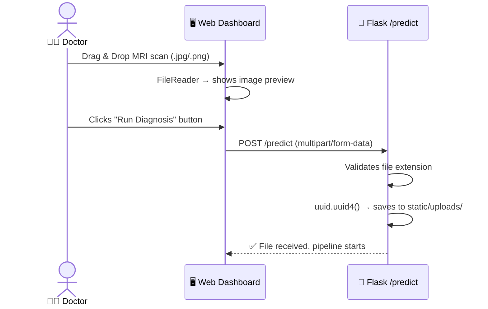
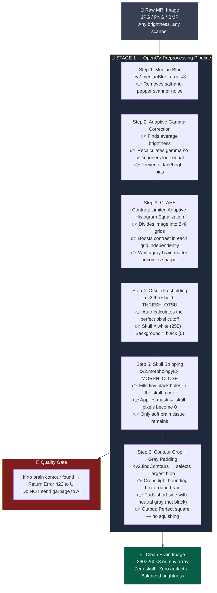
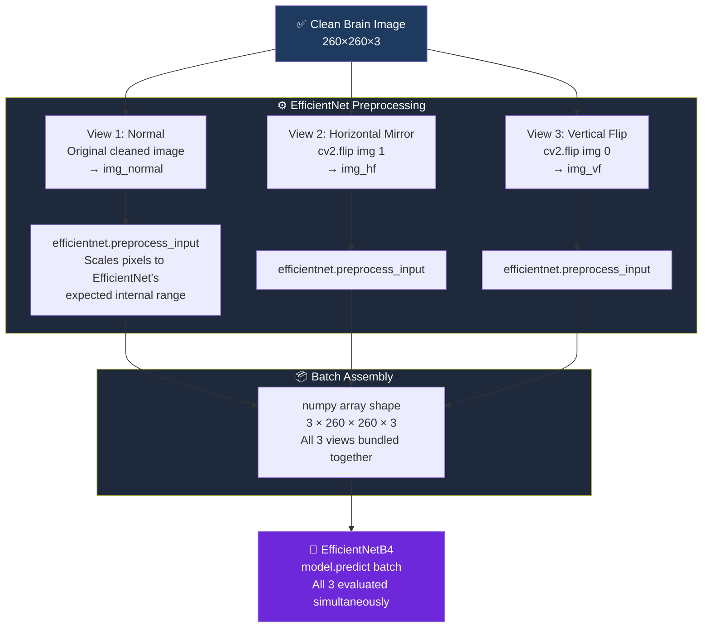
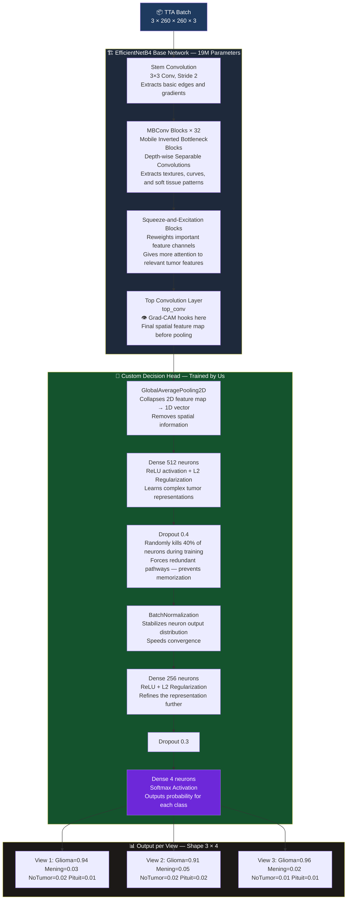
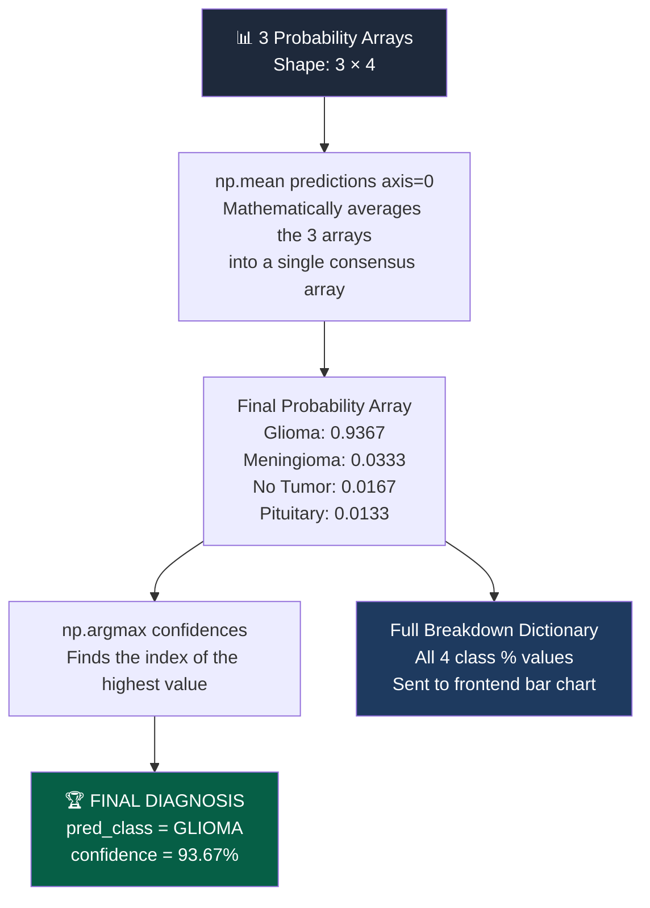
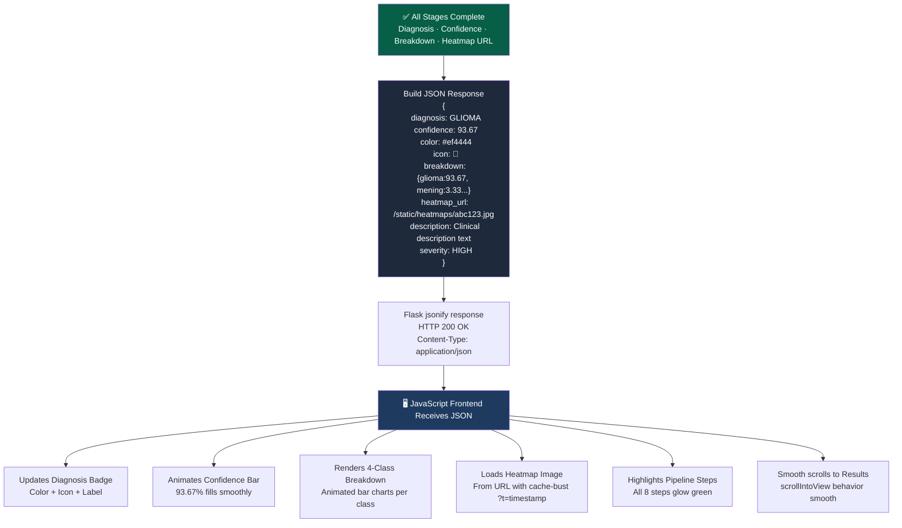
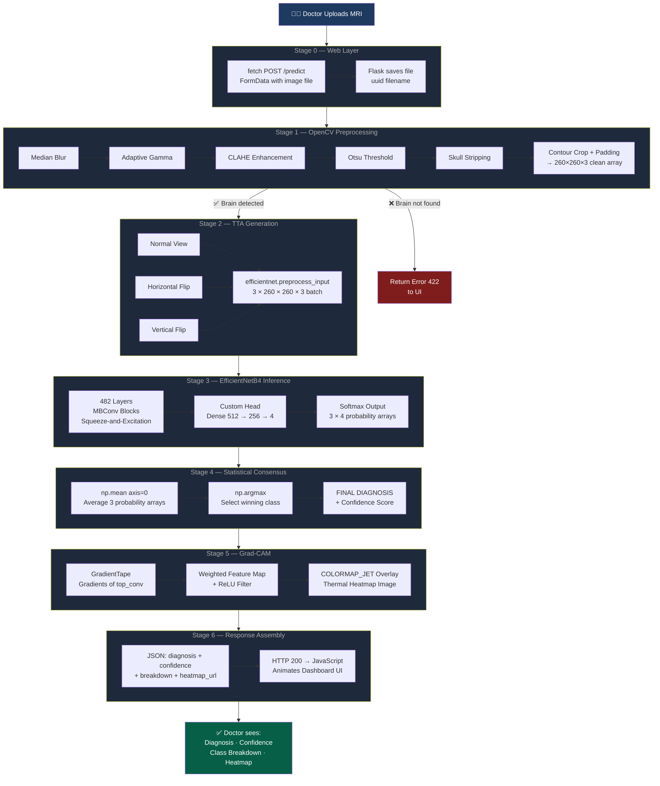

# 🧠 NeuroScan AI — Brain Tumor Detection System

<div align="center">


**A production-grade, hybrid deep learning pipeline for MRI-based brain tumor classification.**

[🚀 Quick Start](#-quick-start) · [📐 Architecture](#-complete-under-the-hood-pipeline) · [📊 Results](#-results--performance) · [🛡️ Defense Notes](#️-viva-defense-notes)

</div>

---

## 📌 Project Overview

| Feature | Detail |
|---|---|
| **Task** | 4-Class Medical Classification |
| **Classes** | Glioma · Meningioma · Pituitary · No Tumor |
| **Architecture** | EfficientNetB4 + Custom Decision Head |
| **Preprocessing** | 6-Stage OpenCV Hybrid Pipeline |
| **Inference** | 3-Angle Test-Time Augmentation (TTA) |
| **Explainability** | Grad-CAM Thermal Heatmaps |
| **Backend** | Python Flask REST API |
| **Test Accuracy** | **97.74%** on 840 unseen MRI images |

---

## 🔬 Complete Under-The-Hood Pipeline

> This section shows **exactly** what happens from the millisecond a doctor uploads an MRI to the moment the final answer appears on the screen.

---

### 📍 STAGE 0 — Doctor Uploads the Image (Browser → Flask)



---

### 📍 STAGE 1 — OpenCV 6-Stage Diagnostic Filtration

> The raw MRI is intercepted and cleaned **before** the AI ever sees it. If the brain cannot be detected, the image is rejected.



---

### 📍 STAGE 2 — Test-Time Augmentation (The 3-Angle Double-Tap)

> The cleaned image is **never** evaluated just once. It is forked into 3 geometric variants to eliminate the risk of a badly-angled hospital scan breaking the AI.



---

### 📍 STAGE 3 — EfficientNetB4 Under The Hood

> This shows what physically happens inside the 482-layer neural network when our image batch enters it.



---

### 📍 STAGE 4 — Statistical Averaging & Final Classification



---

### 📍 STAGE 5 — Grad-CAM Heatmap Generation

> Using calculus, we reverse-engineer the model to prove exactly *where* it was looking.

```mermaid
flowchart TD
    A["🧠 EfficientNetB4 Model\n+ Preprocessed Image\n+ Predicted Class Index"]

    A --> B["Build Grad Model\ntf.keras.Model\nInputs: original input\nOutputs: top_conv layer + final predictions"]

    B --> C["tf.GradientTape\nRecord all mathematical operations\nas image passes through model"]

    C --> D["Extract Gradients\nGrad of GLIOMA output neuron\nw.r.t. top_conv feature map activations\n👉 Which pixels most changed the Glioma score?"]

    D --> E["Global Average Pool the Gradients\nnp.mean grads axis 0 1\nOne importance weight per feature channel"]

    E --> F["Weighted Feature Map\nMultiply each feature map channel\nby its importance weight\nSum all weighted channels together"]

    F --> G["ReLU Filter\nnp.maximum heatmap 0\nOnly keep positive activations\nNegative = not contributing to this class"]

    G --> H["Resize Heatmap\ncv2.resize to 260×260\nMatches original image dimensions"]

    H --> I["Normalize 0-255\nScales activation values\nto full visible color range"]

    I --> J["Apply Color Map\ncv2.applyColorMap COLORMAP_JET\nBlue = Low Activation\nRed = High Activation = Tumor Focus"]

    J --> K["Overlay on Original\ncv2.addWeighted\nHeatmap blended onto clean brain image\n0.4 opacity"]

    K --> L["🌡️ Final Thermal Heatmap\nSaved to static/heatmaps/\nURL returned in JSON response"]

    style A fill:#1e293b,color:#fff
    style D fill:#6d28d9,color:#fff
    style J fill:#7f1d1d,color:#fff
    style L fill:#065f46,color:#fff
```



---

### 📍 STAGE 6 — Flask Packages & Returns the Final Response



---

### 📍 COMPLETE END-TO-END SUMMARY FLOW



---

## 📁 Project Structure

```
NeuroScan/
│
├── app/
│   ├── app.py                           # Flask server + /predict route + TTA logic
│   ├── templates/index.html             # Clinical dark-mode dashboard
│   └── static/
│       ├── uploads/                     # Incoming MRI files
│       └── heatmaps/                    # Grad-CAM outputs
│
├── src/
│   ├── preprocess.py                    # 6-Stage OpenCV Preprocessor
│   ├── predict.py                       # CLI inference with TTA
│   ├── grad_cam.py                      # GradientTape heatmap engine
│   ├── train_efficientnet.py            # Phase A + B local training
│   ├── train_colab_v2.py                # Colab GPU training (final run)
│   └── split_data.py                    # Dataset split utility
│
├── models/
│   └── neuroscan_efficientnet_final.keras   # Trained model — 97.74%
│
├── dataset_cropped/
│   ├── train/                           # 6,790 augmented MRIs
│   ├── val/                             # 840 MRIs
│   └── test/                           # 840 unseen MRIs (never touched)
│
└── README.md
```

---

## 📊 Results & Performance

### Classification Report — 840 Unseen Test Images

| Class | Precision | Recall | F1-Score | Support |
|---|---|---|---|---|
| **Glioma** | 0.98 | 0.97 | **0.97** | 210 |
| **Meningioma** | 0.94 | 0.96 | **0.95** | 210 |
| **No Tumor** | 1.00 | 1.00 | **1.00** | 210 |
| **Pituitary** | 0.99 | 0.98 | **0.99** | 210 |
| **Overall** | | | **0.98** | 840 |

### Architecture Progression

| Model | Val Accuracy | Parameters |
|---|---|---|
| VGG16 Baseline | 89.40% | 138 Million |
| VGG16 Phase C | 92.50% | 138 Million |
| EfficientNetB4 Phase A | 88.81% | 19 Million |
| **EfficientNetB4 Phase B (Final)** | **97.74%** | **19 Million** |

> **Result: 7× fewer parameters, 8.34% higher accuracy than VGG16**

---

## 🚀 Quick Start

```bash
# 1. Clone & setup
git clone https://github.com/your-username/NeuroScan.git
cd NeuroScan
python -m venv venv
.\venv\Scripts\Activate.ps1

# 2. Install
pip install tensorflow opencv-python flask numpy scikit-learn matplotlib seaborn

# 3. Download model → place in models/neuroscan_efficientnet_final.keras

# 4. Launch
cd app && python app.py
# Open: http://127.0.0.1:5000
```

### CLI Inference

```bash
python src/predict.py path/to/mri.jpg
```

```
=============================================
 NEUROSCAN — MRI ANALYSIS RESULTS
=============================================
  Diagnosis  : GLIOMA
  Confidence : 93.67%
---------------------------------------------
 Breakdown:
  - glioma       :  93.67%
  - meningioma   :   3.33%
  - notumor      :   1.67%
  - pituitary    :   1.33%
=============================================
```

---

## 🛡️ Viva Defense Notes

| Question | Answer Summary |
|---|---|
| *Why Hybrid Pipeline?* | OpenCV forces AI to analyze tumor tissue, not skull/artifacts |
| *Why EfficientNet over VGG16?* | Compound Scaling: 97% accuracy with 7× fewer parameters |
| *Why TTA?* | Eliminates Geometric Bias — consensus from 3 angles |
| *Why Grad-CAM?* | Clinical proof the AI looks at tumor mass, not background |
| *Why 97% not 99%?* | Honest 4-class score vs. binary Data-Leaked 99% |
| *Why Phase Training?* | Prevents Catastrophic Forgetting of ImageNet edge detectors |
| *Why Label Smoothing 0.1?* | Prevents overconfidence; improves generalization |
| *Why Dropout 0.4?* | Forces redundant pathways — kills memorization |

---

## 🔮 Future Improvements

| Enhancement | Description |
|---|---|
| **Vision Transformers (ViT)** | Global attention across brain patches |
| **3D CNNs on DICOM volumes** | Full NIfTI volumetric tumor mass in mm³ |
| **Focal Loss** | Penalty focused on hard Meningioma/Glioma confusion |
| **Model Ensembling** | EfficientNetB4 + DenseNet201 vote consensus |

---

<div align="center">

Built for the **NeuroScan Medical AI Thesis Project**  
EfficientNetB4 · OpenCV · Flask · Grad-CAM · TTA · 97.74%

</div>
