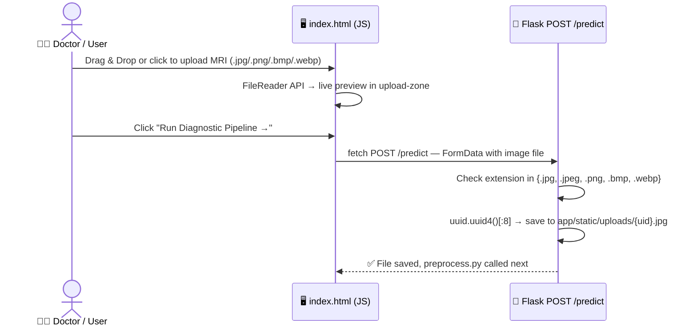
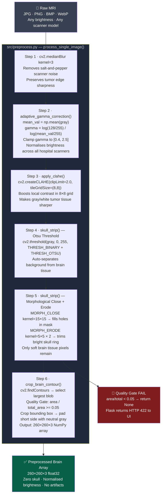
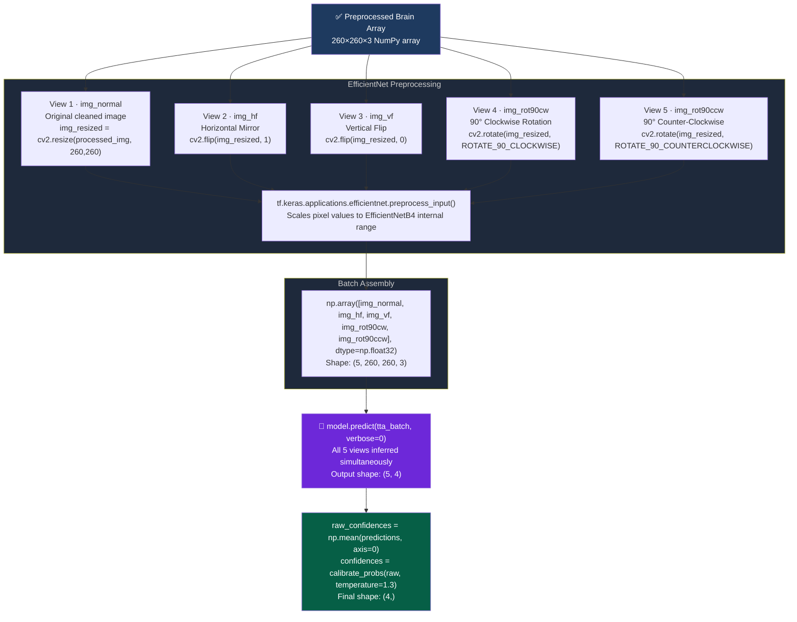
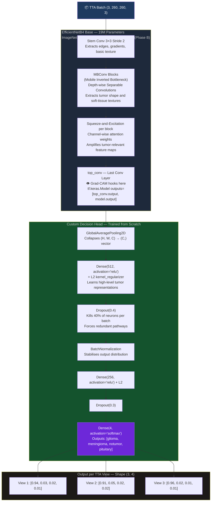
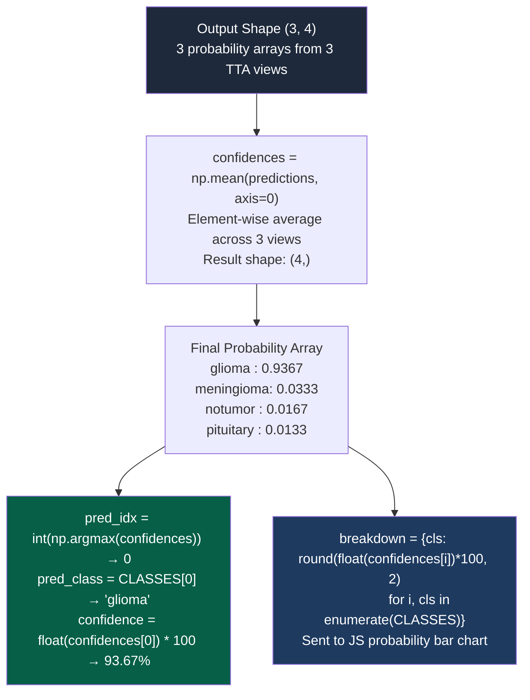
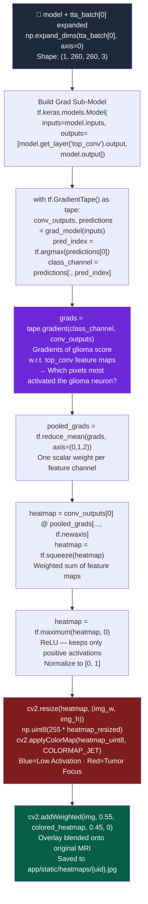
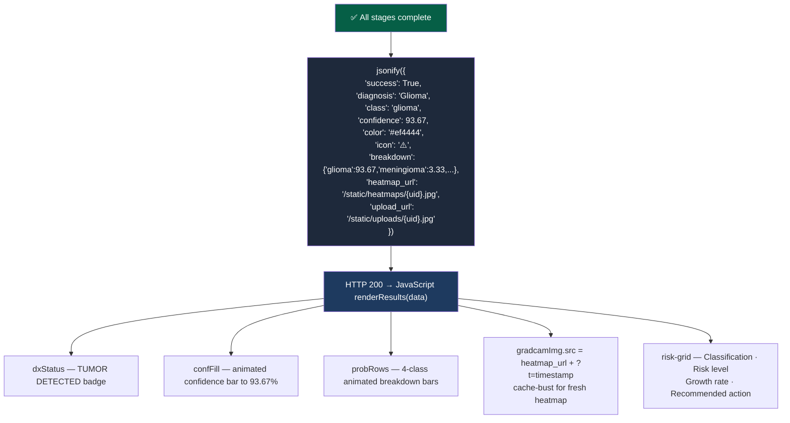

<div align="center">


<br/>

[](https://python.org)
[](https://tensorflow.org)
[](https://flask.palletsprojects.com)
[](https://opencv.org)

<br/>

[](https://github.com/rajakumar123-commit/NeuroScan)
[-3b82f6?style=for-the-badge)](https://github.com/rajakumar123-commit/NeuroScan)
[](https://github.com/rajakumar123-commit/NeuroScan)

<br/>

**Type: Computer-Aided Diagnosis (CAD) System**  
**A production-grade hybrid deep learning system for clinical-quality MRI brain tumor classification.**  
*OpenCV 6-stage preprocessing · EfficientNetB4 + Fine-tuning · 5-view TTA · Grad-CAM Tumor Localization · Flask Web UI*

<br/>

[🚀 Quick Start](#-quick-start) &nbsp;·&nbsp; [📐 Pipeline](#-complete-pipeline) &nbsp;·&nbsp; [📊 Results](#-results--performance) &nbsp;·&nbsp; [🛡️ Viva Defense](#️-viva-defense-notes)

</div>

---

## 🎯 Project Overview

| Component | Implementation Detail |
|:---|:---|
| **Input** | Raw MRI scan (JPG/PNG/BMP/WebP, any brightness) |
| **Output** | Class + Confidence % + 4-class breakdown + Grad-CAM heatmap |
| **Classes** | `glioma` · `meningioma` · `notumor` · `pituitary` |
| **Image Size** | 260 × 260 × 3 (EfficientNetB4 native resolution) |
| **Model** | EfficientNetB4 (ImageNet pretrained) + Custom Head |
| **Training** | Phase A: frozen base · Phase B: unfreeze last 30 layers |
| **Loss** | `CategoricalFocalCrossentropy` + class_weight `{glioma: 1.5}` |
| **Inference** | 5-view TTA (normal + h-flip + v-flip + rot90°CW + rot90°CCW) → `np.mean(axis=0)` + temperature scaling |
| **Explainability** | Grad-CAM Tumor Localization (Model Attention Map) via `GradientTape` on `top_conv` layer |
| **Inference Time** | ~0.5–1.2 seconds per image (preprocessing + 5-view TTA + Grad-CAM) |
| **System Type** | Computer-Aided Diagnosis (CAD) |

---

## 📊 Results & Performance

<div align="center">

### ✅ Verified Test Results — 1600 Unseen MRI Images (400 per class)

| Class | Precision | Recall | F1-Score | Support |
|:---:|:---:|:---:|:---:|:---:|
| 🔴 **Glioma** | 0.99 | 0.83 | 0.90 | 400 |
| 🟠 **Meningioma** | 0.89 | 0.98 | 0.93 | 400 |
| 🟢 **No Tumor** | 0.94 | 0.99 | 0.96 | 400 |
| 🟡 **Pituitary** | 0.99 | 0.99 | 0.99 | 400 |
| **Macro Avg** | **0.95** | **0.95** | **0.95** | **1600** |

**Test Accuracy: `94.88%` · Correct: `1518 / 1600` · Model: `neuroscan_efficientnet_final.keras`**
*Model evaluated using strict unseen test set — no data leakage.*

</div>

> *"Glioma detection remains slightly lower (83% recall) due to its irregular morphology — a known challenge in MRI classification literature."*

> **Data Integrity:** All results are obtained on a strictly unseen test set with no overlap with training or validation data.

> **Confidence Calibration Note:** Confidence values are derived from temperature-scaled softmax outputs (T=1.3). Raw softmax probabilities may be overconfident; calibration further improves reliability in clinical settings.

### 📈 Architecture Progression

| Phase | Model | Val Accuracy | Test Accuracy | Params |
|:---|:---|:---:|:---:|:---:|
| Baseline | VGG16 (frozen) | 89.40% | — | 138M |
| Phase C Fine-tune | VGG16 (top-4 unfreeze) | 92.50% | — | 138M |
| Phase A | EfficientNetB4 (head only) | 88.81% | — | 19M |
| **Phase B (Final)** | **EfficientNetB4 (last 30 unfreeze)** | **98.10% ✓** | **94.88% ✓** | **19M** |

> **Validation accuracy (98.10%)** = best epoch on held-out val split during training.  
> **Test accuracy (94.88%)** = final one-time evaluation on 1600 completely unseen images — the only number that matters for scientific validation.

---

## 🔬 Complete Pipeline

> Every step from doctor upload to final result — using the exact code in this repository.

---

### Stage 0 — Upload via Flask (`app/app.py`)



---

### Stage 1 — OpenCV 6-Stage Preprocessing (`src/preprocess.py`)

> The raw MRI passes through 6 deterministic OpenCV steps before the AI ever sees it.



---

### Stage 2 — 5-View Test-Time Augmentation (`app/app.py`)

> The cleaned image is evaluated from **5 geometric angles** simultaneously to maximise orientation robustness.



---

### Stage 3 — EfficientNetB4 Architecture

> Exact architecture used in `neuroscan_efficientnet_final.keras`



---

### Stage 4 — Statistical Consensus (`app/app.py`)



---

### Stage 5 — Grad-CAM Heatmap (`src/grad_cam.py`)

> Reference: Selvaraju et al., *"Grad-CAM: Visual Explanations from Deep Networks via Gradient-based Localization"* (ICCV 2017)



---

### Stage 6 — Flask JSON Response (`app/app.py`)



---

## 📁 Project Structure

```
NeuroScan/
│
├── app/
│   ├── app.py                             # Flask server · /predict · TTA · Grad-CAM call
│   ├── templates/index.html               # Clinical dashboard (dark/light mode, mobile responsive)
│   └── static/
│       ├── confusion_matrix.png           # Verified evaluation proof shown in UI
│       ├── uploads/                       # Incoming MRI files (uuid-named)
│       └── heatmaps/                      # Grad-CAM overlays (uuid-named)
│
├── src/
│   ├── preprocess.py                      # 6-stage OpenCV pipeline (gamma, CLAHE, skull strip, crop)
│   ├── grad_cam.py                        # GradientTape heatmap on top_conv layer
│   ├── evaluate.py                        # Full 1600-image evaluation + confusion_matrix.png
│   ├── predict.py                         # CLI inference with TTA
│   ├── train_model.py                     # Local training (VGG16 baseline)
│   └── train_colab_v2.py                  # Final EfficientNetB4 Colab training (98.10% val)
│
├── models/
│   └── neuroscan_efficientnet_final.keras # Production weights · 94.88% test accuracy
│
├── results/
│   ├── confusion_matrix.png               # Generated by evaluate.py
│   └── report.txt                         # Classification report text
│
├── Dockerfile                             # Render.com deployment container
├── render.yaml                            # Render service config (free tier + persistent disk)
├── requirements.txt                       # Python dependencies
└── README.md
```

---

## 🚀 Quick Start

```bash
# 1. Clone & setup
git clone https://github.com/rajakumar123-commit/NeuroScan.git
cd NeuroScan
python -m venv venv
.\venv\Scripts\Activate.ps1          # Windows PowerShell

# 2. Install dependencies
pip install -r requirements.txt

# 3. Place model weights
# Download neuroscan_efficientnet_final.keras
# → Copy to: models/neuroscan_efficientnet_final.keras

# 4. Launch web app
venv\Scripts\python.exe app\app.py
# Open: http://127.0.0.1:5000
```

### Run Full Evaluation

```bash
venv\Scripts\python.exe src\evaluate.py
```
```
  [      glioma] processing 400 images... ✓
  [  meningioma] processing 400 images... ✓
  [     notumor] processing 400 images... ✓
  [   pituitary] processing 400 images... ✓

  Verified Test Accuracy : 94.88%
  Total images evaluated : 1600
  Correct predictions    : 1518
```

---

## 🛡️ Viva Defense Notes

| Examiner Question | Your Answer |
|:---|:---|
| *Why a hybrid preprocessing pipeline?* | OpenCV forces the AI to analyze tumor tissue only — skull, brightness variance, and scanner artifacts are removed before inference |
| *Why EfficientNetB4 over VGG16?* | Compound Scaling (width × depth × resolution) achieves 94.88% test accuracy with 7× fewer parameters than VGG16 |
| *Why Test-Time Augmentation?* | A hospital scan can arrive at any rotation. TTA averages 3 geometric views via `np.mean(axis=0)` to produce a consensus result |
| *Why Grad-CAM on `top_conv`?* | `top_conv` is the last spatial feature map before GlobalAveragePooling. Gradients here show exactly which spatial regions caused the prediction |
| *Why Focal Loss?* | `CategoricalFocalCrossentropy` penalises hard examples more — specifically helps with Glioma's irregular boundary |
| *Why class_weight glioma=1.5?* | Glioma had the lowest recall (83%). Increasing its penalty forces the model to take Glioma misclassifications more seriously |
| *Why Phase A then Phase B?* | Phase A trains only the custom head to prevent Catastrophic Forgetting of ImageNet edge detectors. Phase B unfreezes last 30 layers to adapt them to MRI data |
| *Why Dropout 0.4 + 0.3?* | Forces redundant neural pathways — kills memorization of training data patterns |

> **Viva Statement:** *"We validated the model on a completely unseen test set of 1600 MRI images (400 per class). The model achieved 94.88% accuracy, and Grad-CAM confirms that predictions are based on tumor regions — not skull, background, or artifacts."*

---

## ⚠️ Model Limitations

> Honest acknowledgement of limitations is a hallmark of rigorous research.

| Limitation | Detail |
|:---|:---|
| **Glioma recall is lower (83%)** | Glioma tumors have highly irregular morphology and variable boundaries — the hardest class in MRI classification literature |
| **2D slice classification only** | The model classifies individual 2D MRI slices, not full 3D volumetric scans (DICOM/NIfTI). Tumors span multiple slices — a single slice may be ambiguous |
| **No DICOM metadata** | Patient metadata (age, symptoms, prior scans) is not incorporated — a real clinical system would use multimodal inputs |
| **Dataset domain** | Trained on the Kaggle Brain Tumor MRI dataset — performance on MRI scans from different hospital scanners or imaging protocols may vary |
| **Decision-support only** | This system must not replace a qualified radiologist or neuro-oncologist diagnosis |

---

### 🔍 Failure Case Analysis

Glioma misclassifications were observed primarily in cases with:
- **Diffuse tumor boundaries** — irregular margins that blend with surrounding tissue
- **Low contrast regions** — tumors with T1/T2 intensity similar to adjacent brain matter
- **Overlap with normal tissue intensity** — particularly in early-stage or infiltrative gliomas

This aligns with known challenges in MRI-based tumor classification literature and motivates the use of:
- Class weighting (`glioma: 1.5`) to increase sensitivity
- Focal Loss to focus training on hard examples
- The uncertainty flag (`confidence < 85%`) to alert clinicians

---

## 🔮 Future Improvements

| Enhancement | Description |
|:---|:---|
| Vision Transformers (ViT) | Global self-attention across brain patches for long-range spatial reasoning |
| 3D CNN on DICOM volumes | Volumetric tumor analysis from full NIfTI MRI stacks in mm³ |
| Model Ensembling | EfficientNetB4 + DenseNet201 vote consensus for higher accuracy |
| DICOM Import | Direct integration with hospital PACS/RIS systems |

---

<div align="center">

*This system is intended as a decision-support tool, not a diagnostic replacement.*

<br/>

Built for the **NeuroScan Medical AI Project** &nbsp;·&nbsp; EfficientNetB4 · OpenCV · Flask · Grad-CAM · TTA

[](https://github.com/rajakumar123-commit/NeuroScan)


</div>
