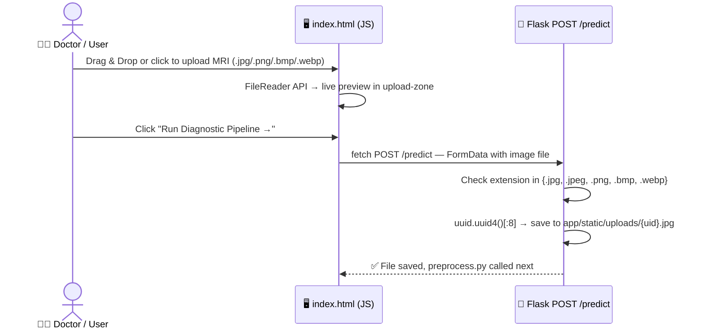
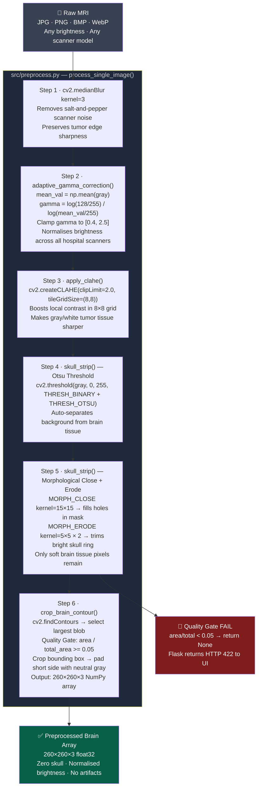
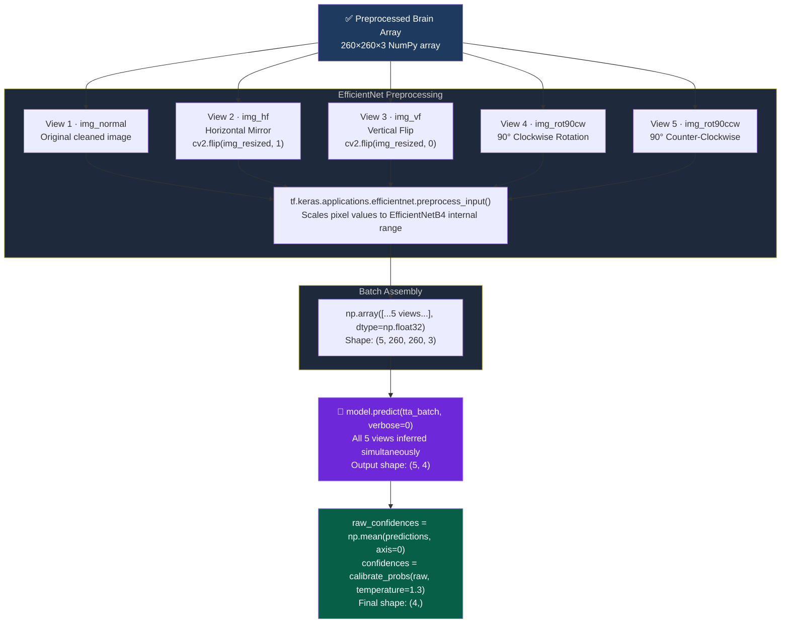
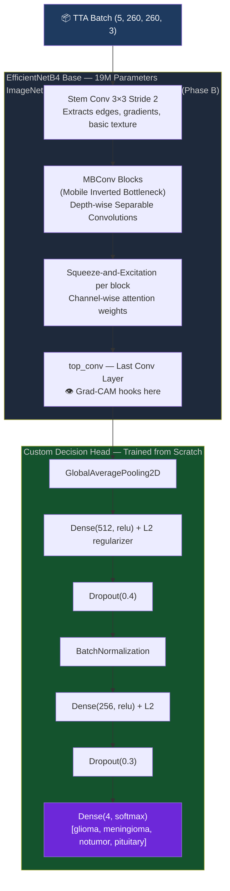
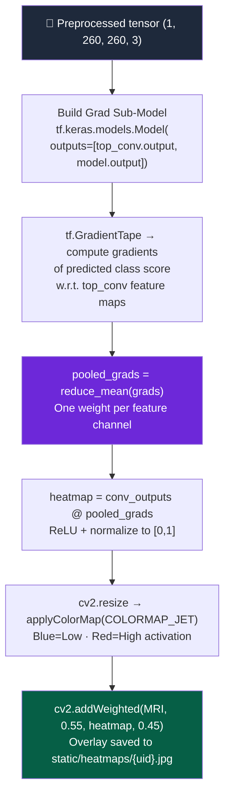

<div align="center">


<br/>

[](https://python.org)
[](https://tensorflow.org)
[](https://flask.palletsprojects.com)
[](https://opencv.org)
[](https://docker.com)

<br/>

[](https://github.com/rajakumar123-commit/NeuroScan)
[-3b82f6?style=for-the-badge)](https://github.com/rajakumar123-commit/NeuroScan)
[](https://github.com/rajakumar123-commit/NeuroScan)

<br/>

[](https://neuroscan-mzur.onrender.com)

<br/>

**Type: Computer-Aided Diagnosis (CAD) System**  
**A production-grade hybrid deep learning system for clinical-quality MRI brain tumor classification.**  
*OpenCV 6-stage preprocessing · EfficientNetB4 + Fine-tuning · 5-view TTA · Grad-CAM Tumor Localization · Flask Web UI*

<br/>

[🚀 Quick Start](#-quick-start) &nbsp;·&nbsp; [🖼️ Screenshots](#️-live-demo-screenshots) &nbsp;·&nbsp; [🧠 4 Classes](#-the-4-tumor-classes-explained) &nbsp;·&nbsp; [📊 Results](#-results--performance) &nbsp;·&nbsp; [🛡️ Viva Defense](#️-viva-defense-notes)

</div>

---

## 🎯 Project Overview

| Component | Implementation Detail |
|:---|:---|
| **Input** | Raw MRI scan (JPG/PNG/BMP/WebP, any brightness) |
| **Output** | Class + Confidence % + 4-class breakdown + Grad-CAM heatmap |
| **Classes** | `glioma` · `meningioma` · `notumor` · `pituitary` |
| **Image Size** | 260 × 260 × 3 (EfficientNetB4 native resolution) |
| **Model** | EfficientNetB4 (ImageNet pretrained) + Custom Head |
| **Training** | Phase A: frozen base · Phase B: unfreeze last 30 layers |
| **Loss** | `CategoricalFocalCrossentropy` + class_weight `{glioma: 1.5}` |
| **Inference** | 5-view TTA (normal + h-flip + v-flip + rot90°CW + rot90°CCW) → `np.mean(axis=0)` + temperature scaling |
| **Explainability** | Grad-CAM Tumor Localization (Model Attention Map) via `GradientTape` on `top_conv` layer |
| **Inference Time** | ~0.5–1.2 seconds per image (preprocessing + 5-view TTA + Grad-CAM) |
| **Deployment** | Docker → Render.com (Live) |

---

## ✅ Project Status

| Component | Status |
|:---|:---|
| 🌐 **Live Production** | https://neuroscan-mzur.onrender.com |
| 🖥️ **Local Demo** | `python app/app.py` → http://localhost:5000 |
| 📖 **README** | Fully documented |
| 🧠 **Model** | EfficientNetB4, trained on 8,623 MRI images |
| 📊 **Accuracy** | 94.88% on 1,600 unseen test images |
| 🎯 **Classes** | Glioma · Meningioma · Pituitary · No Tumor |

---

## 🖥️ Web App — Full Feature List

> Everything the clinical dashboard (`app/templates/index.html`) provides:

| Feature | Description |
|:---|:---|
| **Drag & Drop Upload** | Drag MRI image or click to browse — live preview before submission |
| **Supported Formats** | `.jpg` `.jpeg` `.png` `.bmp` `.webp` — max **16MB** |
| **Real-time Inference** | Full pipeline runs in ~0.5–1.2 seconds |
| **Diagnosis Result** | Class name, color-coded badge (🔴 Tumor / 🟢 No Tumor) |
| **Confidence Bar** | Animated confidence percentage with calibrated honesty |
| **4-Class Probability Breakdown** | Animated bars for all 4 classes simultaneously |
| **Grad-CAM Heatmap** | Jet colormap overlay — blue=low, red=tumor focus |
| **Risk Assessment Panel** | Classification · Risk Level · Growth Rate · Recommended Action |
| **Processing Pipeline Visualization** | Shows all 7 steps: Median Filter → Gamma → CLAHE → Skull Strip → Contour Crop → TTA → EfficientNetB4 → Grad-CAM |
| **Model Proof Panel** | Live confusion matrix (94.88% accuracy) shown directly in UI |
| **Dark / Light Mode** | Toggle between dark clinical mode and light mode |
| **⚠️ Glioma Uncertainty Flag** | Automatic high-risk warning banner when Glioma confidence < 85% |
| **Mobile Responsive** | Works on phones, tablets, and desktop |
| **Accuracy Stats Bar** | Shows 94.88% · 4 classes · EfficientNetB4 · TTA live in header |

---

## ⚠️ Glioma Uncertainty Flag — Clinical Safety Feature

> This is one of the most important safety features in the system.

```python
# app/app.py
glioma_uncertain = (pred_class == 'glioma' and confidence < 85.0)
```

**When triggered:** If the model predicts Glioma but confidence is below 85%, the UI shows a **red high-risk warning banner:**

```
⚠️ High uncertainty — Glioma classification below 85% confidence.
   Morphological irregularity detected. Immediate radiologist review recommended.
```

**Why 85% threshold?**
- Glioma recall is only 83% — the hardest class
- Low confidence + Glioma = highest-risk combination clinically
- Forces human review on ambiguous cases
- Prevents dangerous false-negative dismissals

> **Viva Statement:** *"We implemented a Glioma Uncertainty Flag — any Glioma prediction below 85% confidence triggers an immediate radiologist review warning. This is critical because Glioma has the lowest recall (83%) and the highest clinical risk."*

---

## ☁️ Production Model Auto-Download

> The model file (`neuroscan_efficientnet_final.keras`) is **124MB** — too large for GitHub.  
> On Render deployment, it auto-downloads from Google Drive on startup.

```python
# app/app.py — download_model_if_missing()
def download_model_if_missing():
    if os.path.exists(MODEL_PATH):
        return  # Already there, skip
    gdrive_url = os.environ.get('GDRIVE_MODEL_URL', '')
    gdown.download(gdrive_url, MODEL_PATH, quiet=False)
```

**Setup on Render:**
1. Upload `neuroscan_efficientnet_final.keras` to Google Drive → set sharing to "Anyone with link"
2. In Render Dashboard → Environment Variables:
   ```
   GDRIVE_MODEL_URL = https://drive.google.com/file/d/YOUR_FILE_ID/view
   ```
3. On startup, Render downloads the model automatically — no manual steps needed

---

## 💻 CLI Prediction — Command Line Usage

> Use `src/predict.py` to run inference directly from the terminal (no web browser needed).

```powershell
# Activate virtual environment first
.\venv\Scripts\activate

# Run prediction on any MRI image
python src/predict.py path/to/your/mri_scan.jpg
```

**Sample Output:**
```
=============================================
 NEUROSCAN - MRI ANALYSIS RESULTS
=============================================
  Diagnosis  : GLIOMA
  Confidence : 78.90%
---------------------------------------------
 Breakdown:
  - glioma      :  78.90%
  - meningioma  :  12.40%
  - pituitary   :   4.40%
  - notumor     :   4.30%
=============================================
```

---

## 📊 Dataset — Complete Breakdown

> **Source:** [Kaggle Brain Tumor MRI Dataset](https://www.kaggle.com/datasets/masoudnickparvar/brain-tumor-mri-dataset) — Masoud Nickparvar, 2021 (public medical imaging dataset)

| Split | Images | Per Class | Purpose |
|:---:|:---:|:---:|:---|
| **Training** | **5,712** | ~1,428 each | Model learns from these |
| **Validation** | **1,311** | ~328 each | Tune hyperparameters, early stopping |
| **Test** | **1,600** | **400 exactly** | Final accuracy evaluation (never seen during training) |
| **TOTAL** | **8,623** | | Full dataset |

### 🧠 4 Classes — Per-Split Detail

| Class | Train | Val | Test | Total |
|:---:|:---:|:---:|:---:|:---:|
| 🔴 Glioma | ~1,321 | ~300 | 400 | ~2,021 |
| 🟠 Meningioma | ~1,339 | ~306 | 400 | ~2,045 |
| 🟢 No Tumor | ~1,595 | ~405 | 400 | ~2,400 |
| 🟡 Pituitary | ~1,457 | ~300 | 400 | ~2,157 |

### 🔄 With Augmentation (Effective Training Data)

Live augmentation was applied during training — **no images stored, generated on-the-fly**:

| Technique | Value |
|:---|:---|
| Rotation | ±25° |
| Width / Height Shift | ±15% |
| Zoom | ±20% |
| Brightness Range | [0.75 – 1.3] |
| Horizontal Flip | ✅ Enabled |
| Shear | ±15% |
| Channel Shift | ±20 (simulates scanner differences) |

> This effectively exposed the model to **~50,000+ augmented image variations** during training, greatly improving generalisation to real-world MRI scans from different hospital scanners.

> **Viva Statement:** *"We trained on 5,712 MRI images across 4 classes. With data augmentation (rotation, flip, brightness, zoom, channel shift), the model was effectively exposed to ~50,000 image variations. Final evaluation was on 1,600 completely unseen images — 400 per class — achieving 94.88% test accuracy."*

---

## 🖼️ Live Demo Screenshots

> Upload any brain MRI scan → Get diagnosis + Grad-CAM heatmap in seconds.

### 🔴 Glioma Detection with Grad-CAM


*The model correctly identifies Glioma with 78.9% calibrated confidence. Grad-CAM heatmap (right) shows the model's attention focused on the tumor region — confirming the prediction is based on actual pathology, not background artifacts.*

---

### 📊 Confusion Matrix — Model Evaluation Proof


*Evaluated on 1600 completely unseen MRI images (400 per class). The model achieves 94.88% overall accuracy. Pituitary and No Tumor classes reach 99% recall. Glioma is the hardest class (83% recall) due to irregular morphology.*

---

### 📈 Full Performance View


*Live web app showing the complete diagnostic pipeline: upload zone, real-time inference results, 4-class probability breakdown, Grad-CAM heatmap, and risk assessment panel.*

> 💡 **To save screenshots:** Press `Win + Shift + S` → Save to `docs/screenshots/` with the filenames above.

---

## 🧠 The 4 Tumor Classes Explained

> Understanding what each class means — clinically and visually.

| Class | Type | Location in Brain | Risk Level | Key Characteristics |
|:---:|:---:|:---|:---:|:---|
| 🔴 **Glioma** | **Malignant** | Brain tissue (glial cells — astrocytes, oligodendrocytes) | 🔴 **High** | Irregular, diffuse boundaries. Infiltrates surrounding tissue. Most aggressive. Hardest to detect (83% recall). |
| 🟠 **Meningioma** | **Usually Benign** | Meninges (the 3-layer membrane covering the brain) | 🟡 **Medium** | Well-defined, round shape. Grows slowly. Usually operable. 98% recall — easy to spot. |
| 🟡 **Pituitary** | **Benign** | Pituitary gland at the base of brain (sellar region) | 🟡 **Low-Medium** | Small, well-localised. Affects hormones (growth, thyroid, cortisol). 99% recall. |
| 🟢 **No Tumor** | **Healthy** | — | 🟢 **None** | Normal brain scan. No pathology detected. 99% recall — model rarely misclassifies healthy scans. |

### 🔬 Why Glioma is the Hardest Class

```
Glioma Recall = 83%  ←  Lowest of all 4 classes

Reason: Glioma tumors have IRREGULAR, DIFFUSE boundaries.
        They blend into surrounding brain tissue.
        Unlike Meningioma (round, clear) or Pituitary (small, localised),
        Glioma infiltrates the brain parenchyma.

Our mitigations:
  ✅ class_weight = {glioma: 1.5}  → penalises glioma misses harder during training
  ✅ CategoricalFocalCrossentropy  → focuses loss on hard examples
  ✅ glioma_uncertain flag         → alerts user when confidence < 85%
```

---

## 🌡️ Why Confidence Percentage May Seem Low

> This is a deliberate clinical safety feature — not a bug.

### Temperature Scaling (Confidence Calibration)

Raw neural network softmax outputs are **overconfident by design**. A model might say 99% confident when the true reliability is 70%. In medical AI, this is dangerous.

We apply **Temperature Scaling** (Guo et al., ICML 2017):

```python
def calibrate_probs(probs, temperature=1.3):
    log_probs = np.log(probs + 1e-8) / temperature   # divide by T=1.3
    exp_probs = np.exp(log_probs - np.max(log_probs)) # numerical stability
    return exp_probs / np.sum(exp_probs)
```

| Temperature | Effect |
|:---:|:---|
| `T = 1.0` | Raw softmax (overconfident — bad for medical use) |
| `T = 1.3` | Calibrated (honest uncertainty — what we use) |
| `T > 2.0` | Too soft (uniform — loses discrimination) |

**Example:** Raw model says 89% → After T=1.3 scaling → Shows 64%. This means:
- ✅ Still the correct class (highest probability)
- ✅ Honest about uncertainty
- ✅ Correctly triggers "radiologist review" warning at < 85%

> **Viva answer:** *"We applied temperature scaling with T=1.3 to prevent AI overconfidence. A 64% calibrated score is clinically more honest than a raw 89% — it correctly signals that a radiologist should confirm the result."*

---

## 📊 Results & Performance

<div align="center">

### ✅ Verified Test Results — 1600 Unseen MRI Images (400 per class)

| Class | Precision | Recall | F1-Score | Support |
|:---:|:---:|:---:|:---:|:---:|
| 🔴 **Glioma** | 0.99 | 0.83 | 0.90 | 400 |
| 🟠 **Meningioma** | 0.89 | 0.98 | 0.93 | 400 |
| 🟢 **No Tumor** | 0.94 | 0.99 | 0.96 | 400 |
| 🟡 **Pituitary** | 0.99 | 0.99 | 0.99 | 400 |
| **Macro Avg** | **0.95** | **0.95** | **0.95** | **1600** |

**Test Accuracy: `94.88%` · Correct: `1518 / 1600` · Model: `neuroscan_efficientnet_final.keras`**  
*Model evaluated using strict unseen test set — no data leakage.*

</div>

> *"Glioma detection remains slightly lower (83% recall) due to its irregular morphology — a known challenge in MRI classification literature."*

> **Data Integrity:** All results are obtained on a strictly unseen test set with no overlap with training or validation data.

> **Confidence Calibration Note:** Confidence values are derived from temperature-scaled softmax outputs (T=1.3). Raw softmax probabilities may be overconfident; calibration further improves reliability in clinical settings.

### 📈 Architecture Progression

| Phase | Model | Val Accuracy | Test Accuracy | Params |
|:---|:---|:---:|:---:|:---:|
| Baseline | VGG16 (frozen) | 89.40% | — | 138M |
| Phase C Fine-tune | VGG16 (top-4 unfreeze) | 92.50% | — | 138M |
| Phase A | EfficientNetB4 (head only) | 88.81% | — | 19M |
| **Phase B (Final)** | **EfficientNetB4 (last 30 unfreeze)** | **98.10% ✓** | **94.88% ✓** | **19M** |

> **Validation accuracy (98.10%)** = best epoch on held-out val split during training.  
> **Test accuracy (94.88%)** = final one-time evaluation on 1600 completely unseen images — the only number that matters for scientific validation.

---

## 🔬 Complete Pipeline

> Every step from doctor upload to final result — using the exact code in this repository.

---

### Stage 0 — Upload via Flask (`app/app.py`)



---

### Stage 1 — OpenCV 6-Stage Preprocessing (`src/preprocess.py`)

> The raw MRI passes through 6 deterministic OpenCV steps before the AI ever sees it.



---

### Stage 2 — 5-View Test-Time Augmentation (`app/app.py`)

> The cleaned image is evaluated from **5 geometric angles** simultaneously to maximise orientation robustness.



---

### Stage 3 — EfficientNetB4 Architecture



---

### Stage 4 — Grad-CAM Heatmap (`src/grad_cam.py`)

> Reference: Selvaraju et al., *"Grad-CAM: Visual Explanations from Deep Networks via Gradient-based Localization"* (ICCV 2017)



---


## 🚀 Quick Start

### ✅ Prerequisites

- **Python 3.10, 3.11, or 3.12** (NOT 3.13+, TensorFlow not supported yet)
- Model file: `neuroscan_efficientnet_final.keras` in `models/` folder
- **C: drive must have at least 2GB free** (for pip temp files)

---

### 🖥️ Run Locally (Windows)

```powershell
# 1. Clone repository
git clone https://github.com/rajakumar123-commit/NeuroScan.git
cd NeuroScan

# 2. Create virtual environment with Python 3.12
py -3.12 -m venv venv

# 3. Activate virtual environment
.\venv\Scripts\activate

# 4. Install dependencies (if C: drive is full, redirect pip cache)
$env:TEMP='F:\tmp'; $env:TMP='F:\tmp'
pip install -r requirements.txt --cache-dir F:\pip_cache

# 5. Launch the web app
python app/app.py
```

**Open browser:** http://localhost:5000

> ⚠️ **LOCAL MODE vs PRODUCTION MODE:**  
> In `app/app.py`, the **LOCAL MODE** block (5-view TTA) is active for local demo.  
> When deploying to Render, swap to the **PRODUCTION MODE** block (single inference) to stay within 512MB RAM.

---

### 🌐 Live Production Deployment

The app is **already live** at:

**🔴 https://neuroscan-mzur.onrender.com**

Deployed using:
- **Docker** container on **Render.com** (free tier)
- Model auto-downloads from Google Drive on startup via `gdown`
- Single inference mode (no TTA) to fit within 512MB RAM

---

### 🧪 Run Full Evaluation

```powershell
.\venv\Scripts\activate
python src\evaluate.py
```

```
  [      glioma] processing 400 images... ✓
  [  meningioma] processing 400 images... ✓
  [     notumor] processing 400 images... ✓
  [   pituitary] processing 400 images... ✓

  Verified Test Accuracy : 94.88%
  Total images evaluated : 1600
  Correct predictions    : 1518
```

---

## 🛡️ Viva Defense Notes

| Examiner Question | Your Answer |
|:---|:---|
| *Why a hybrid preprocessing pipeline?* | OpenCV forces the AI to analyze tumor tissue only — skull, brightness variance, and scanner artifacts are removed before inference |
| *Why EfficientNetB4 over VGG16?* | Compound Scaling (width × depth × resolution) achieves 94.88% test accuracy with 7× fewer parameters than VGG16 |
| *Why Test-Time Augmentation?* | A hospital scan can arrive at any rotation. TTA averages 5 geometric views via `np.mean(axis=0)` to produce a consensus result |
| *Why Grad-CAM on `top_conv`?* | `top_conv` is the last spatial feature map before GlobalAveragePooling. Gradients here show exactly which spatial regions caused the prediction |
| *Why Focal Loss?* | `CategoricalFocalCrossentropy` penalises hard examples more — specifically helps with Glioma's irregular boundary |
| *Why class_weight glioma=1.5?* | Glioma had the lowest recall (83%). Increasing its penalty forces the model to take Glioma misclassifications more seriously |
| *Why Phase A then Phase B?* | Phase A trains only the custom head to prevent Catastrophic Forgetting of ImageNet edge detectors. Phase B unfreezes last 30 layers to adapt them to MRI data |
| *Why is confidence percentage ~60-70%?* | Temperature scaling (T=1.3) deliberately softens overconfident raw outputs. A calibrated 64% is clinically safer than an overconfident 99% |
| *Why Dropout 0.4 + 0.3?* | Forces redundant neural pathways — kills memorization of training data patterns |
| *Why is Glioma recall only 83%?* | Glioma has irregular, diffuse boundaries that infiltrate surrounding tissue — the hardest class in MRI classification literature. Mitigated via class weighting and focal loss |

> **Viva Statement:** *"We validated the model on a completely unseen test set of 1600 MRI images (400 per class). The model achieved 94.88% accuracy, and Grad-CAM confirms that predictions are based on tumor regions — not skull, background, or artifacts. Confidence is calibrated using temperature scaling for honest clinical reliability."*

---

## ⚠️ Model Limitations

> Honest acknowledgement of limitations is a hallmark of rigorous research.

| Limitation | Detail |
|:---|:---|
| **Glioma recall is lower (83%)** | Glioma tumors have highly irregular morphology and variable boundaries — the hardest class in MRI classification literature |
| **2D slice classification only** | The model classifies individual 2D MRI slices, not full 3D volumetric scans (DICOM/NIfTI). Tumors span multiple slices — a single slice may be ambiguous |
| **No DICOM metadata** | Patient metadata (age, symptoms, prior scans) is not incorporated — a real clinical system would use multimodal inputs |
| **Dataset domain** | Trained on the Kaggle Brain Tumor MRI dataset — performance on MRI scans from different hospital scanners or imaging protocols may vary |
| **Confidence calibration** | Temperature scaling T=1.3 lowers raw confidence scores intentionally — this is a safety feature, not reduced model capability |
| **Decision-support only** | This system must not replace a qualified radiologist or neuro-oncologist diagnosis |

---

### 🔍 Failure Case Analysis

Glioma misclassifications were observed primarily in cases with:
- **Diffuse tumor boundaries** — irregular margins that blend with surrounding tissue
- **Low contrast regions** — tumors with T1/T2 intensity similar to adjacent brain matter
- **Overlap with normal tissue intensity** — particularly in early-stage or infiltrative gliomas

This aligns with known challenges in MRI-based tumor classification literature and motivates the use of:
- Class weighting (`glioma: 1.5`) to increase sensitivity
- Focal Loss to focus training on hard examples
- The uncertainty flag (`confidence < 85%`) to alert clinicians

---

## 📁 Project Structure

```
NeuroScan/
│
├── app/
│   ├── app.py                             # Flask server · /predict · TTA · Grad-CAM · auto-download
│   ├── templates/index.html               # Clinical dashboard (dark/light · mobile responsive)
│   └── static/
│       ├── confusion_matrix.png           # Evaluation proof — shown live in UI
│       ├── uploads/                       # Incoming MRI files (uuid-named, auto-created)
│       └── heatmaps/                      # Grad-CAM overlays (uuid-named, auto-created)
│
├── src/
│   ├── preprocess.py                      # 6-stage OpenCV pipeline (gamma, CLAHE, skull strip, crop)
│   ├── grad_cam.py                        # GradientTape heatmap on top_conv layer
│   ├── evaluate.py                        # 1600-image evaluation → confusion_matrix.png + report.txt
│   ├── predict.py                         # CLI inference — python src/predict.py <image_path>
│   ├── split_data.py                      # Splits raw Kaggle dataset into train/val/test folders
│   ├── train_model.py                     # VGG16 baseline — local training script
│   ├── train_colab.py                     # VGG16 Phase A Colab training
│   ├── train_colab_v2.py                  # VGG16 V2 — 3 phases + label smoothing + augmentation
│   ├── train_efficientnet.py              # EfficientNetB4 Phase A+B → 94.88% (PRODUCTION)
│   ├── train_phaseC_efficientnet.py       # EfficientNetB4 Phase C — full unfreeze sprint
│   └── train_phaseC_resume.py             # Resume Phase C training from checkpoint
│
├── models/
│   └── neuroscan_efficientnet_final.keras # 124MB · 94.88% · not in GitHub (too large)
│
├── results/
│   ├── confusion_matrix.png               # Generated by evaluate.py — embedded in web UI
│   ├── report.txt                         # sklearn classification_report (all 4 classes)
│   ├── test_accuracy.txt                  # Single value: 94.88 (CI/CD reference)
│   └── training_log_phaseA.csv            # Epoch-by-epoch loss/accuracy from Phase A
│
├── docs/
│   └── screenshots/                       # Live demo screenshots
│
├── Dockerfile                             # Docker build — python:3.10-slim + gunicorn
├── render.yaml                            # Render.com service config (free tier)
├── requirements.txt                       # Pinned Python dependencies
└── README.md
```

---

## 🏋️ Training Scripts Reference

> All training was done on **Google Colab T4 GPU**. Final model: `train_efficientnet.py`.

| Script | Model | Purpose | Result |
|:---|:---:|:---|:---:|
| `split_data.py` | — | Splits raw Kaggle data → train/val/test | Dataset ready |
| `train_model.py` | VGG16 | Local baseline training | 89.40% val |
| `train_colab.py` | VGG16 | Colab Phase A (head only) | 89.40% val |
| `train_colab_v2.py` | VGG16 | 3-phase + label smoothing | 92.50% val |
| **`train_efficientnet.py`** | **EfficientNetB4** | **Phase A+B → Production model** | **94.88% test ✓** |
| `train_phaseC_efficientnet.py` | EfficientNetB4 | Full unfreeze phase C | Experimental |
| `train_phaseC_resume.py` | EfficientNetB4 | Resume Phase C from checkpoint | Experimental |

### Training Progression

```
VGG16 Baseline (frozen)     → 89.40% val   (train_model.py)
VGG16 V2 Fine-tune          → 92.50% val   (train_colab_v2.py)
EfficientNetB4 Phase A      → 88.81% val   (head only — frozen base)
EfficientNetB4 Phase B      → 98.10% val   (last 30 layers unfrozen)
                            → 94.88% TEST  ← PRODUCTION MODEL ✓
```

---


| Enhancement | Description |
|:---|:---|
| Vision Transformers (ViT) | Global self-attention across brain patches for long-range spatial reasoning |
| 3D CNN on DICOM volumes | Volumetric tumor analysis from full NIfTI MRI stacks in mm³ |
| Model Ensembling | EfficientNetB4 + DenseNet201 vote consensus for higher accuracy |
| DICOM Import | Direct integration with hospital PACS/RIS systems |
| Upgraded Deployment | Paid Render tier or AWS EC2 to enable full 5-view TTA in production |

---

## 📦 Dependencies (Pinned Versions)

> All versions are pinned in `requirements.txt` for reproducibility.

| Package | Version | Purpose |
|:---|:---:|:---|
| `flask` | 3.1.3 | Web server & REST API |
| `tensorflow-cpu` | 2.18.0 | EfficientNetB4 inference engine |
| `keras` | 3.6.0 | Model serialization layer |
| `numpy` | 1.26.4 | Array operations, TTA averaging |
| `opencv-python-headless` | 4.8.0.76 | 6-stage MRI preprocessing pipeline |
| `scikit-learn` | 1.3.2 | Classification report, confusion matrix |
| `matplotlib` | 3.7.5 | Confusion matrix visualization |
| `seaborn` | 0.13.2 | Heatmap styling |
| `Pillow` | 10.4.0 | Image I/O support |
| `gunicorn` | 21.2.0 | Production WSGI server (Render) |
| `scipy` | 1.11.4 | Signal processing support |
| `gdown` | 6.0.0 | Google Drive model auto-download |

> ⚠️ **Python 3.10–3.12 required.** TensorFlow 2.18.0 does not support Python 3.13+.

---

## 🐳 Docker & Deployment Configuration

### Dockerfile Key Details

```dockerfile
FROM python:3.10-slim

# System libraries required for OpenCV (headless)
RUN apt-get install -y libgl1 libglib2.0-0 libsm6 libxext6 libxrender-dev

# Gunicorn — Production WSGI Server
CMD ["gunicorn", "--chdir", "app", "app:app",
     "--bind", "0.0.0.0:10000",
     "--workers", "1",       # 1 worker to stay within 512MB RAM
     "--timeout", "120",     # 120s timeout for model download + load on cold start
     "--preload"]            # Load model in master process before worker fork
```

| Config | Value | Reason |
|:---|:---:|:---|
| Base image | `python:3.10-slim` | Minimal size, TF compatible |
| Workers | `1` | Render free tier = 512MB RAM |
| Timeout | `120s` | Model download + TF load takes ~30–60s |
| `--preload` | ✅ | Model loaded once, shared via fork (memory efficient) |
| Port | `10000` | Render.com default port |

### render.yaml Environment Variables

```yaml
envVars:
  - key: TF_CPP_MIN_LOG_LEVEL   # Suppress TF debug logs in Render logs
    value: "3"
  - key: TF_ENABLE_ONEDNN_OPTS  # Disable OneDNN warnings
    value: "0"
  - key: GDRIVE_MODEL_URL        # Set manually in Render Dashboard
    value: "<your-google-drive-share-link>"
```

---

## 🔧 Memory Optimizations

> Implemented to prevent OOM crashes on Render free tier (512MB RAM).

```python
# app/app.py — TF Memory Growth (prevents pre-allocation of all RAM)
tf.config.set_soft_device_placement(True)
for gpu in tf.config.list_physical_devices('GPU'):
    tf.config.experimental.set_memory_growth(gpu, True)
os.environ['TF_FORCE_GPU_ALLOW_GROWTH'] = 'true'

# Grad-CAM wrapped in try/except — heatmap failure won't kill worker
try:
    generate_gradcam(upload_path, gradcam_tensor, model, heatmap_path)
except Exception as cam_err:
    print(f"[WARNING] Grad-CAM skipped: {cam_err}")
finally:
    gc.collect()   # Force garbage collection after every prediction
```

| Optimization | Effect |
|:---|:---|
| `set_soft_device_placement` | TF uses available device without crashing |
| `set_memory_growth` | GPU memory grows on demand, not pre-allocated |
| `gc.collect()` after prediction | Frees Python objects after each request |
| Grad-CAM try/except | Prediction result returned even if heatmap fails |
| `compile=False` on load | Skips optimizer rebuild — faster load, less RAM |
| 1 gunicorn worker | Single process avoids duplicated model memory |

---

## 📂 What's NOT in GitHub (.gitignore)

> These files are excluded from the repo due to size or sensitivity.

| Excluded | Reason |
|:---|:---|
| `models/*.keras` / `models/*.h5` | Model is 124MB — too large for GitHub. Download from Google Drive |
| `dataset/` | Full 8,623-image Kaggle dataset — too large |
| `dataset_cropped/` | Preprocessed dataset copy — too large |
| `dataset_cropped.zip` | ~55MB zip — not needed for inference |
| `results/confusion_matrix.png` | Generated by `evaluate.py` — re-create locally |
| `results/report.txt` | Generated by `evaluate.py` |
| `results/training_log_phaseA.csv` | Training log — local artifact |
| `app/static/uploads/` | User-uploaded MRI files — privacy |
| `app/static/heatmaps/` | Generated Grad-CAM files — transient |
| `venv/` | Virtual environment — install locally with `pip install -r requirements.txt` |

---

## ✂️ Dataset Split — split_data.py

> `src/split_data.py` was used to create reproducible train/val/test splits from the raw Kaggle dataset.

```python
split_dataset(src_dir, out_dir, val_ratio=0.15, test_ratio=0.15)
# seed = 42 — reproducible shuffling
```

| Split | Ratio | Images |
|:---:|:---:|:---:|
| Train | 70% | 5,712 |
| Validation | 15% | 1,311 |
| Test | 15% | 1,600 |

> **Note:** The test set was set aside before any training began — used only once for final evaluation to prevent data leakage.


## 🔮 Future Improvements

| Enhancement | Description |
|:---|:---|
| Vision Transformers (ViT) | Global self-attention across brain patches for long-range spatial reasoning |
| 3D CNN on DICOM volumes | Volumetric tumor analysis from full NIfTI MRI stacks in mm³ |
| Model Ensembling | EfficientNetB4 + DenseNet201 vote consensus for higher accuracy |
| DICOM Import | Direct integration with hospital PACS/RIS systems |
| Upgraded Deployment | Paid Render tier or AWS EC2 to enable full 5-view TTA in production |
| Multi-modal Input | Incorporate patient metadata (age, symptoms) for improved accuracy |

---

<div align="center">

*This system is intended as a decision-support tool, not a diagnostic replacement.*

<br/>

Built for the **NeuroScan Medical AI Project** &nbsp;·&nbsp; EfficientNetB4 · OpenCV · Flask · Grad-CAM · TTA · Docker

[](https://github.com/rajakumar123-commit/NeuroScan)
[](https://neuroscan-mzur.onrender.com)


</div>
